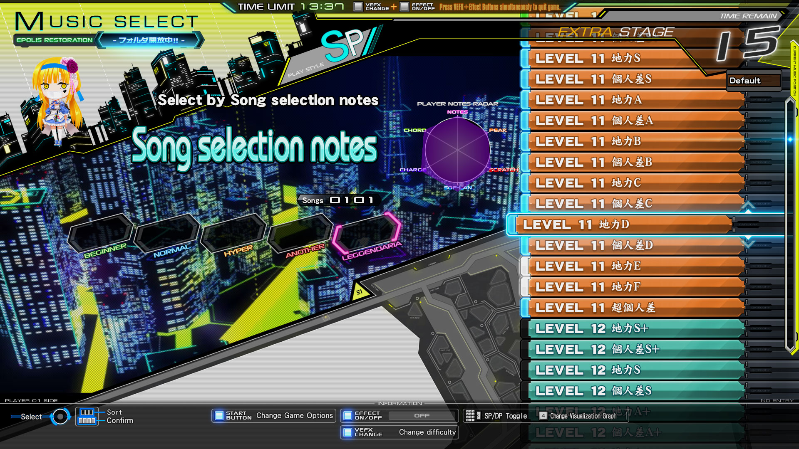

## playlister3

Re-introduces the playlist functionality to beatmania IIDX 31 EPOLIS with various usability improvements

### Compatibility

Offsets are specific to the LDJ-2024082600 game version

### Usage

- Build and copy `playlister3.dll` to the game directory
- Create the `playlister/playlists` directory and populate with `.yml` playlists
- Add `-k playlister3.dll` (or `-K` for Bemanitools) to your launcher options

Custom bar textures are loaded from the `data/graphic/0/mselect.ifs` file. [IFS LayeredIFS](https://github.com/mon/ifs_layeredfs/releases/) can be used to add or replace images without modifying the original file

SpiceTools has an integrated version of IFS LayeredIFS, but it is no longer maintained and has known issues. It is recommended to use the latest version from the link above, unless you will not use custom bar textures